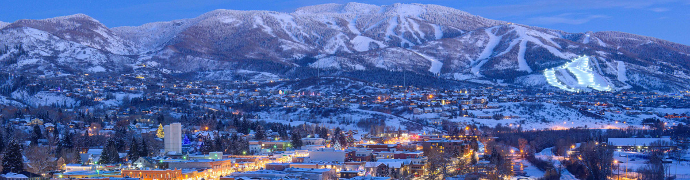

# Visit me in Colorado

Hey, friends! remember when I said you should come visit me in CO and you thought - "Damn that sounds fun, but I bet he will never follow up & I will never get to shred some of that sweet, sweet pow"

Well guess what, you're in luck, I did follow up (at least with most of you I think)!

Yep I really want you to come visit so grab your shred-mobile, put a time on my calendar, eat a power bar, stay healthy, swig some water, huck a quick sick 180 from normal life and fly out.

Below I have included a collection of travel logistics that I will continue to update as I learn more about this wholesome adventure. So stay tuned and the rest is up to you. :)

# Travel Logistics

The address is [1900 Bridge Ln, Steamboat Springs, CO 80487](https://www.google.com/maps/search/1900+Bridge+Ln,+Steamboat+Springs,+CO+80487/@40.494811,-106.9104126,12z) Unit \#1

Looks like there are two options to get there:
  - Denver International Airport (DEN)
    - [3 hr 22 min drive](https://www.google.com/maps/dir/Denver+International+Airport,+Denver,+CO/Grand+Lake+Plumbing+Co,+1900+Bridge+Ln,+Steamboat+Springs,+CO+80487/@40.0611699,-106.8861266,8z/data=!3m1!4b1!4m14!4m13!1m5!1m1!1s0x876c67ef9bb9d89f:0x400fd836808e49bc!2m2!1d-104.6728573!2d39.8487935!1m5!1m1!1s0x8742688eb79fea43:0xe634543384fa9a79!2m2!1d-106.8566089!2d40.496138!3e0)
    - [$71 round trip from Chicago](https://www.google.com/flights?hl=en#flt=/m/01_d4.DEN.2021-01-14*DEN./m/01_d4.2021-01-18;c:USD;e:1;sd:1;t:f)
  - Yampa Valley Regional Airport also know as Hayden (HDN) Airport
    - [29 min drive](https://www.google.com/maps/dir/Yampa+Valley+Regional+Airport,+County+Road+51A,+Hayden,+CO/Grand+Lake+Plumbing+Co,+1900+Bridge+Ln,+Steamboat+Springs,+CO+80487/@40.492097,-107.3183463,10z/data=!3m1!4b1!4m14!4m13!1m5!1m1!1s0x8742523fa068453b:0x75f9448fbf1e0344!2m2!1d-107.2197265!2d40.4847488!1m5!1m1!1s0x8742688eb79fea43:0xe634543384fa9a79!2m2!1d-106.8566089!2d40.496138!3e0)
    - [$500 round trip from Chicago](https://www.google.com/flights?hl=en#flt=/m/01_d4.HDN.2021-01-14*HDN./m/01_d4.2021-01-18;c:USD;e:1;sd:1;t:f)

Denver seems to be the more popular option on google flights

The [Ikon Passes](https://www.ikonpass.com/en/shop-passes) seem to be some of the best value packages to get on the mountain this year
  - [4 day](https://www.ikonpass.com/en/shop-passes/ikon-session-pass-4-day-2020-2021) would probably make sense for an aggressive long weekend or a chill week
  - As a side note it doesn't seem, as of now, that the mountain will be offering single day passes
